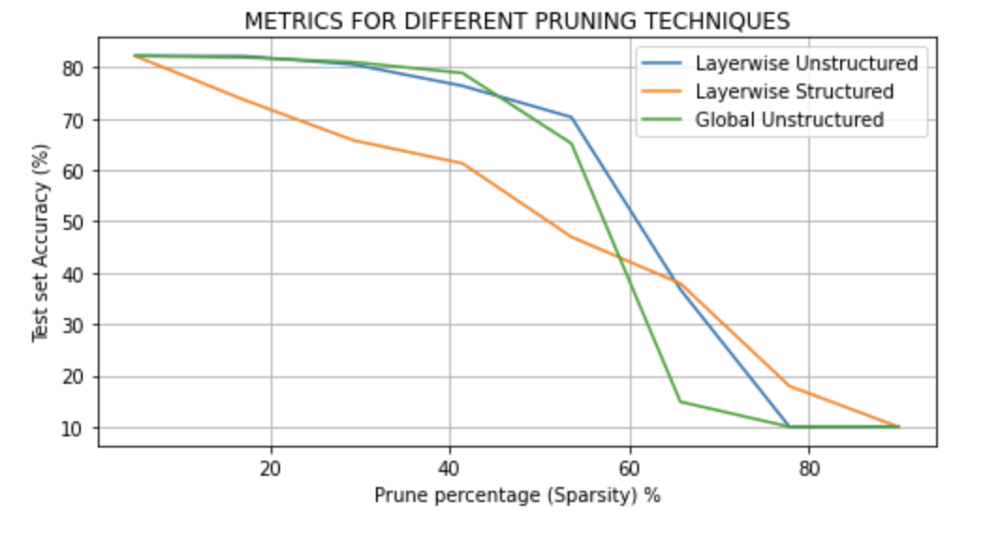

# Neural-Optimization

## Static Quantization
```
-------------
 Metrics of fp32_deeplabv3 
-------------
Device = cpu
Model FileSize = 158.975196 MB
Single batch inference Time of model = 907.1372747421265 milliseconds
-------------
 Metrics of quantized_deeplabv3 
-------------
Device = cpu
Model FileSize = 40.25734 MB
Single batch inference Time of model = 876.7441272735596 milliseconds
```

### Result


## Pruning

### Result

### Metrics for different pruning techniques


## Knowledge Distillation
-------------
 Metrics of Teacher 
-------------
Device = cpu
40965.789184 MMACs, 81931.578368 MFLOPs and 39.638355 M parameters
Model FileSize = 158.937101 MB
Single batch inference Time of model = 1358.0917358398438 milliseconds
IOU Teacher: 0.597
-------------
 Metrics of Student (Before KD) 
-------------
Device = cpu
2473.780208 MMACs, 4947.560416 MFLOPs and 11.024963 M parameters
Model FileSize = 44.391197 MB
Single batch inference Time of model = 116.77095890045166 milliseconds
IOU Student 0.489
-------------
 Metrics of KD Student 
-------------
Device = cpu
2473.780208 MMACs, 4947.560416 MFLOPs and 11.024963 M parameters
Model FileSize = 44.391197 MB
Single batch inference Time of model = 136.01408004760742 milliseconds
IOU KD Student 0.526

#### Student vs Teacher
* **IOU** of student is **22% worse** than teacher
* **Inference time** of student is **12x faster** than teacher

#### KD Student vs Teacher
* **IOU** of KD Student is **13% worse** than teacher
* **Inference time** is **12x faster** than teacher

#### KD Student vs Student
*   **IOU** is **8% better** than student.
*   **Inference Time** is **similar**

### Result

